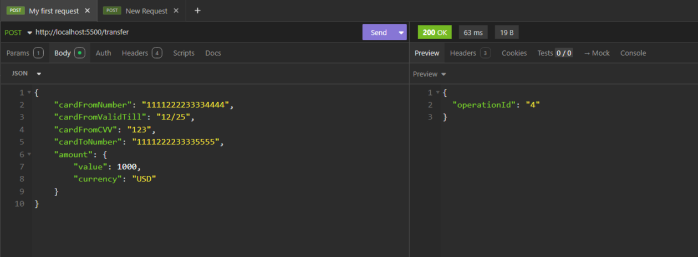
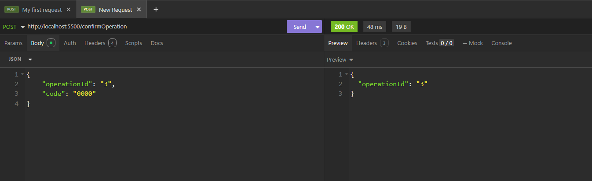
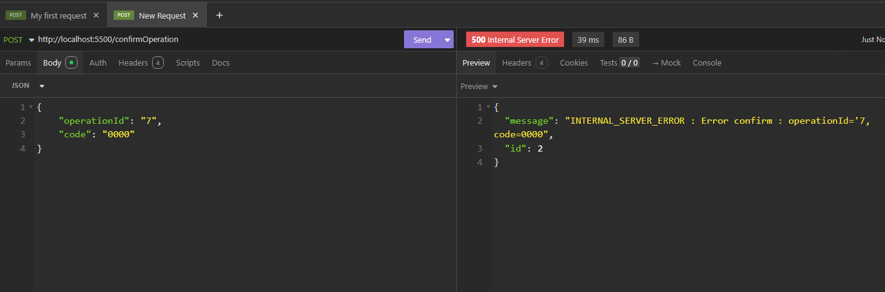

# Курсовой проект "Сервис перевода денег"
## Описание проекта
Представляет собой разработанное приложение REST-сервис для перевода денежных средств с одной карты на другую по заранее описанной спецификации(протоколу).
Взаимодействует с заранее подготовленным веб-приложением (FRONT) по адресу https://serp-ya.github.io/card-transfer/
Все операции записываются в [лог файл](log.txt).
## Запуск приложения
* Запуск производится с помощью Docker Compose командой:
> docker-compose up -d
* Для совместимости с FRONT приложение работает на порту 5500
> http://localhost:5500/
>
## Пример запросов
* Запрос Post на инициализацию трансфера денежных средств:

* Запрос Post трансфера денежных средств по operationId:

* Запрос POST на несуществующий трансфер денежных средств:
